

# Fourier 音频分析仪  
## Fourier Audio Analyzer

**Android 端实时频谱、波形与声级测量工具 · 教学与工程调试兼顾**  
*Real-time spectrum, waveform, and SPL tools for Android — suitable for education and engineering*

---

## 目录 · Table of contents

| 中文 | English |
|------|---------|
| [1. 项目概述](#cn-overview) | [1. Project overview](#en-overview) |
| [2. 学习目标与适用场景](#cn-learning) | [2. Learning goals & use cases](#en-learning) |
| [3. 核心能力](#cn-features) | [3. Core capabilities](#en-features) |
| [4. 界面与功能截图](#cn-gallery) | [4. Screenshots & UI tour](#en-gallery) |
| [5. 预编译 APK（发布）](#cn-download) | [5. Prebuilt APK (release)](#en-download) |
| [6. 构建与运行](#cn-build) | [6. Build & run](#en-build) |
| [7. 文档索引](#cn-docs) | [7. Documentation index](#en-docs) |

**截图快速跳转 · Quick jump to figures**  
[通用设置](#cn-fig-general) · [频谱设置](#cn-fig-spectrum-settings) · [示波器设置](#cn-fig-scope-settings) · [可视化设置](#cn-fig-vis-settings) · [瀑布图设置](#cn-fig-wf-settings) · [分贝计设置](#cn-fig-spl-settings) · [频谱视图](#cn-fig-spectrum-bars) · [频谱曲线](#cn-fig-spectrum-line) · [示波器](#cn-fig-scope) · [瀑布图](#cn-fig-waterfall) · [声级计](#cn-fig-spl)  

---

## 1. 项目概述

**Fourier 音频分析仪**（包名 `com.fourier.audioanalyzer`）是一款面向 Android 的**实时音频分析**应用：在设备上对麦克风或系统回放声进行采集，完成 **FFT 频谱**、**时域波形（示波器）**、**频谱瀑布图**与 **声级计（SPL）** 等可视化与测量，并支持 PCM 录制与截图等辅助功能。

设计目标是在移动端提供接近桌面测量软件的可读参数展示（采样率、FFT 点数、重叠、帧率、峰值频率等），便于**课堂教学**（FFT、对数频率轴、窗函数与加权概念）、**现场排障**与**主观听感相关的频谱对照**。

## 1. Project overview

**Fourier Audio Analyzer** (`com.fourier.audioanalyzer`) is an Android app for **real-time audio analysis**. It captures microphone or system playback audio (where supported), then visualizes **FFT spectra**, **time-domain waveforms (oscilloscope)** , **spectrogram-style waterfall plots**, and a **sound level meter (SPL)** view, with optional PCM recording and screenshots.

The UI emphasizes readable engineering readouts (sample rate, FFT size, overlap, frame rate, peak frequency, etc.), making it useful for **teaching** (FFT, log-frequency axes, windowing, weighting), **field troubleshooting**, and **spectral comparisons** alongside listening.

---

## 2. 学习目标与适用场景

| 主题 | 读者可以观察或练习的内容 |
|------|--------------------------|
| 采样与带宽 | 44.1 kHz 采样率与可显示频率上限的关系（奈奎斯特概念） |
| 频谱分辨率 | FFT 点数、频率分辨率 \(\Delta f = f_s / N\) 与刷新率的权衡 |
| 显示尺度 | 线性 / 对数 / 音律频率轴对读谱习惯的影响 |
| 时频分析 | 瀑布图将「频率—时间—能量」同时映射为颜色 |
| 声级测量 | A/C/Z 加权、快/慢时间计权与峰值、Leq 等统计量 |

## 2. Learning goals & use cases

| Topic | What you can observe or practice |
|------|-----------------------------------|
| Sampling & bandwidth | Relationship between sample rate (e.g. 44.1 kHz) and the analyzable frequency range (Nyquist idea) |
| Spectral resolution | Trade-offs among FFT size, \(\Delta f = f_s / N\), overlap, and update rate |
| Display scales | How linear / log / musical frequency axes change reading habits |
| Time–frequency views | Waterfall plots map frequency, time, and level to color |
| Sound levels | A/C/Z weighting, fast/slow time weighting, peaks, and statistics such as Leq |

---

## 3. 核心能力

- **实时 FFT 频谱**：多种窗函数与频谱斜率补偿；峰值检测与标记；线谱 / 频带等多种呈现方式（与设置联动）。  
- **示波器**：时域波形、触发与同步相关选项（用于稳定周期信号观察）。  
- **瀑布图**：时间—频率—能量伪彩色图，支持灵敏度等映射参数。  
- **声级计**：加权、时间计权与统计曲线；适合课堂演示与粗略环境声对比（非计量级认证替代）。  
- **输入源**：麦克风（含原始/系统处理链路差异）、系统内录（Android 10+，受系统策略约束）。  

## 3. Core capabilities

- **Real-time FFT spectrum**: windowing, spectral slope compensation, peak detection/markers, and multiple visualization styles tied to settings.  
- **Oscilloscope**: time-domain waveform with trigger/sync options for stable periodic signals.  
- **Waterfall / spectrogram view**: time–frequency–level mapping with tunable color mapping (e.g. sensitivity).  
- **Sound level meter**: weighting, time weighting, and statistics for demos and rough comparisons (not a certified metrology replacement).  
- **Inputs**: microphone paths (raw vs processed) and system capture on supported Android versions.  

---

## 4. 界面与功能截图

以下图片为应用内实际界面摘录，用于对照功能模块与术语。**点击图片下方锚点**可在本文内跳转回目录。

### 4. Screenshots & UI tour

The figures below are authentic in-app captures for feature identification. Use the **figure index** at the top to jump within this document.

---

#### 图 1 · 通用设置（信号源与显示）

通用页可配置波形配色、增益、信息面板开关，以及麦克风原始/系统处理/系统内录等信号源，便于对比不同链路的频响与噪声表现。

*English:* Configure waveform colors, gain, the info overlay, and input routing (raw mic vs processed mic vs system capture) to compare noise and frequency response across capture chains.

| 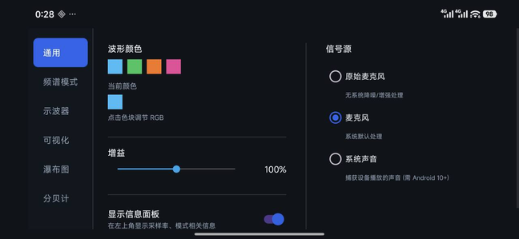 |
|:--:|
| **Figure 1 · General settings:** gain, overlay panel, waveform color, and input source selection. |

---

#### 图 2 · 频谱模式相关设置

可选择信息栏显示项（峰值频率、FFT/采样率、帧率等）、频率轴缩放方式（线性 / 对数 / 音律），并调节峰值检测阈值与峰值数量，用于控制「读谱」细节密度。

*English:* Choose overlay fields (peak frequency, FFT/sample rate, frame rate, etc.), frequency axis scaling (linear / log / musical), and peak detection thresholds/counts to control how “busy” the spectrum readout appears.

| 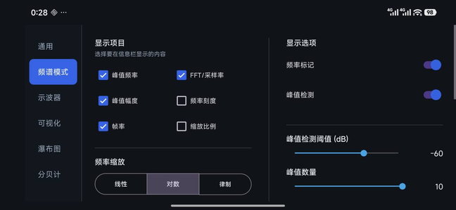 |
|:--:|
| **Figure 2 · Spectrum mode settings:** overlay fields, frequency axis scale, peak detection. |

---

#### 图 3 · 示波器设置

信息栏可显示时间窗、触发状态、采样率等；支持触发同步、沿类型与单次触发等，用于理解**稳定显示周期波形**的基本概念。

*English:* The overlay can show time window, trigger state, and sample rate; trigger sync, edge type, and single-shot modes help stabilize periodic waveforms—useful for teaching *triggering* basics.

| 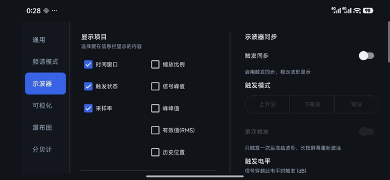 |
|:--:|
| **Figure 3 · Oscilloscope settings:** overlay metrics and trigger options. |

---

#### 图 4 · 可视化（频带）参数

频段数量、灵敏度与频谱斜率等参数影响「条形频谱」的颗粒度与高频可视补偿，便于演示**感知响度与频谱显示**之间的差异。

*English:* Band count, sensitivity, and spectral slope shape the bar spectrum’s resolution and treble emphasis—good for contrasting *perceived loudness* with *spectral visualization*.

| 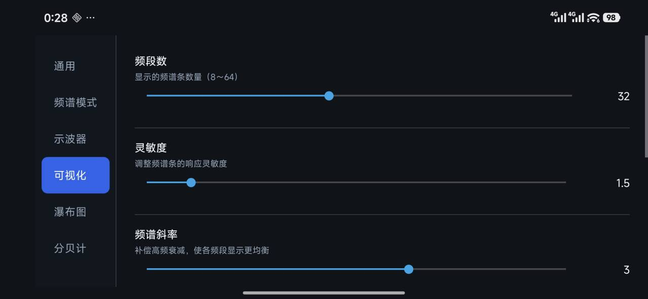 |
|:--:|
| **Figure 4 · Visualization settings:** band count, sensitivity, spectral slope. |

---

#### 图 5 · 瀑布图设置

可选择信息栏中的峰值频率、灵敏度等；其中**灵敏度**影响弱信号在伪彩色映射中的可见度，与信噪比和配色动态范围密切相关。

*English:* Select overlay fields such as peak frequency and sensitivity; *sensitivity* controls how weak components appear in the color map—closely tied to SNR and colormap dynamics.

| 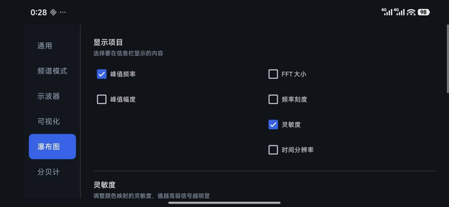 |
|:--:|
| **Figure 5 · Waterfall settings:** overlay fields and sensitivity (color mapping). |

---

#### 图 6 · 声级计（加权与响应）

支持 A/C/Z/平坦等频率加权，以及快/慢时间计权，用于对照**环境噪声评价**中常见的 dB(A) 与 time weighting 概念。

*English:* A/C/Z/flat weighting plus fast/slow time weighting mirror common **environmental noise** metrics—ideal for explaining dB(A) and time-weighting in class.

| 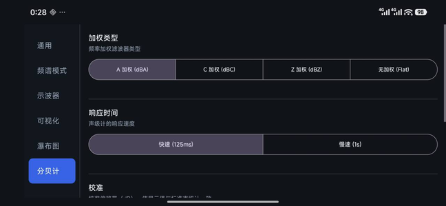 |
|:--:|
| **Figure 6 · SPL meter settings:** frequency & time weighting. |

---

#### 图 7 · 实时频谱（频带柱状图）

对数频率轴与 dB 幅度轴下的柱状频谱示例；左上角叠加采样率、FFT 尺寸、重叠与帧率等信息，便于将**测量读数**与**显示流畅度**联系起来。

*English:* Bar spectrum on a log-frequency axis with dB magnitude; on-screen readouts link **measurement parameters** (FFT size, overlap) to **perceived UI smoothness** (FPS).

| 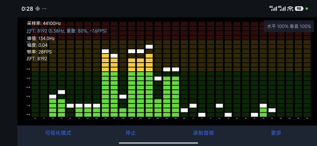 |
|:--:|
| **Figure 7 · Real-time spectrum (bars):** log-frequency axis with engineering readouts. |

---

#### 图 8 · 实时频谱（线谱）

线谱模式更适合观察连续频谱形状与峰值位置；可与图 7 对照同一信号在不同呈现下的读图方式。

*English:* The line spectrum emphasizes continuous spectral shape and peak locations—compare with Figure 7 to discuss how *representation* changes reading for the same signal.

| 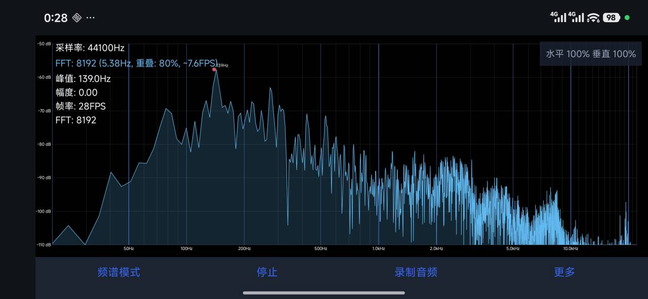 |
|:--:|
| **Figure 8 · Real-time spectrum (line):** continuous spectrum shape and peaks. |

---

#### 图 9 · 示波器波形

时域波形与窗口时长、触发状态等信息；用于将**声压随时间变化**与频谱域结果对照理解。

*English:* Time-domain pressure vs time, with window length and trigger state—pairs naturally with spectral views to relate *time evolution* and *frequency content*.

| 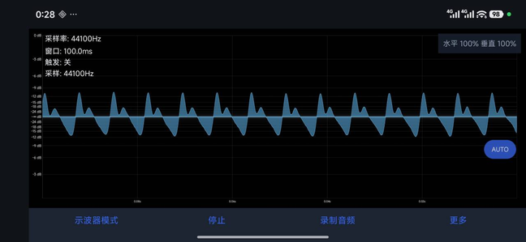 |
|:--:|
| **Figure 9 · Oscilloscope waveform:** time-domain view with key readouts. |

---

#### 图 10 · 频谱瀑布图（时频图）

频率沿水平轴、时间沿垂直轴（新数据通常在上方或按设置滚动），颜色表示能量强弱；适合讲解**时变信号**与**谱峰随时间迁移**。

*English:* Frequency on the horizontal axis, time on the vertical axis (scroll direction depends on settings), color encodes level—ideal for *non-stationary* signals and migrating peaks.

| 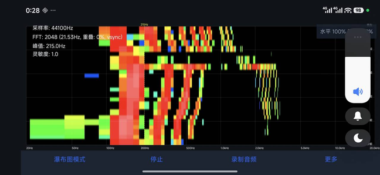 |
|:--:|
| **Figure 10 · Waterfall / spectrogram:** time–frequency–level visualization. |

---

#### 图 11 · 声级计主界面

大读数区、量程条、历史曲线与最大/最小/平均/Leq 等统计量，用于课堂演示**声级起伏与统计量差异**。

*English:* Large numeric readout, range bar, history trace, and statistics (max/min/avg/Leq) illustrate how *instantaneous level* differs from *summary metrics*.

| 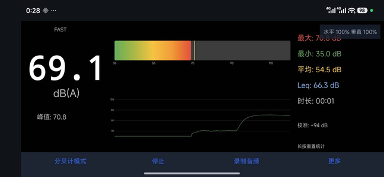 |
|:--:|
| **Figure 11 · SPL meter (main):** level readout, bar, history, and statistics. |

---

## 5. 预编译 APK（发布）

仓库提供与当前 `versionName` 对齐的 **Release 构建**安装包（经调试证书签名，便于侧载体验；**非**应用商店正式证书，详见 [`releases/README.md`](releases/README.md)）。

| 项目 | 说明 |
|------|------|
| 文件 | [`releases/Fourier-audio-analyzer-v1.0.0.apk`](releases/Fourier-audio-analyzer-v1.0.0.apk) |
| 直链 | [GitHub raw 下载](https://github.com/JasonXie-Code/Fourier/raw/main/releases/Fourier-audio-analyzer-v1.0.0.apk) |
| SHA-256 | `6970F2638AAE56EE2B60A8277265407DD274F19CBA4FF5E51B3CAD70A9FED452` |
| GitHub Releases 侧栏 | 需在网页 **[创建 Release](https://github.com/JasonXie-Code/Fourier/releases/new?tag=v1.0.0)**（标签 `v1.0.0` 已推送），并上传 APK 后才会显示；详见 [`releases/README.md`](releases/README.md) 开头说明。 |

*English:* A **release build** APK is published under `releases/` (signed with the **Android debug keystore** for easy sideloading—**not** a Play Store production key). See [`releases/README.md`](releases/README.md) for integrity checks and install notes. **GitHub’s Releases sidebar** requires **[publishing a Release](https://github.com/JasonXie-Code/Fourier/releases/new?tag=v1.0.0)** (tag `v1.0.0` is already on the remote) and attaching the APK.

## 5. Prebuilt APK (release)

The repository ships a **release-built** APK aligned with `versionName` (signed with the **debug keystore** for sideloading—**not** a Play Store signing key; details in [`releases/README.md`](releases/README.md)).

| Item | Details |
|------|---------|
| File | [`releases/Fourier-audio-analyzer-v1.0.0.apk`](releases/Fourier-audio-analyzer-v1.0.0.apk) |
| Direct link | [Raw download on GitHub](https://github.com/JasonXie-Code/Fourier/raw/main/releases/Fourier-audio-analyzer-v1.0.0.apk) |
| SHA-256 | `6970F2638AAE56EE2B60A8277265407DD274F19CBA4FF5E51B3CAD70A9FED452` |
| GitHub Releases UI | Publish a **[Release](https://github.com/JasonXie-Code/Fourier/releases/new?tag=v1.0.0)** (tag `v1.0.0` is pushed) and attach the APK so it appears in the sidebar—see [`releases/README.md`](releases/README.md). |

---

## 6. 构建与运行

1. 使用 **Android Studio** 或命令行打开 `android/` 目录下的工程。  
2. 配置 **Android SDK** 与 **JDK**（版本以 `android/build.gradle.kts` 与 Gradle Wrapper 为准）。  
3. 更详细的离线依赖、脚本与工具链说明见：  
   - [`Docs/BUILD_INSTRUCTIONS.md`](Docs/BUILD_INSTRUCTIONS.md)  
   - [`Docs/QUICKSTART.md`](Docs/QUICKSTART.md)  

## 6. Build & run

1. Open the Gradle project under `android/` with **Android Studio** or the command line.  
2. Install a compatible **Android SDK** and **JDK** (see `android/build.gradle.kts` and the Gradle wrapper).  
3. For offline/tooling notes, see [`Docs/BUILD_INSTRUCTIONS.md`](Docs/BUILD_INSTRUCTIONS.md) and [`Docs/QUICKSTART.md`](Docs/QUICKSTART.md).  

---

## 7. 文档索引

| 文档 | 说明 |
|------|------|
| [`PROJECT.md`](PROJECT.md) | 模块与目录结构说明 |
| [`ROADMAP.md`](ROADMAP.md) | 路线图与计划 |
| [`Docs/`](Docs/) | 功能说明、离线构建与开发笔记 |
| [`Photos/README.md`](Photos/README.md) | 截图文件列表与索引 |
| [`releases/README.md`](releases/README.md) | 预编译 APK 说明与校验 |

## 7. Documentation index

| Doc | Description |
|-----|-------------|
| [`PROJECT.md`](PROJECT.md) | Module & directory overview |
| [`ROADMAP.md`](ROADMAP.md) | Roadmap |
| [`Docs/`](Docs/) | Feature notes, offline build, dev docs |
| [`Photos/README.md`](Photos/README.md) | Screenshot file list |
| [`releases/README.md`](releases/README.md) | Prebuilt APK notes & checksums |

---

**教学提示 · Teaching note**  
应用内读数用于**概念演示与相对对比**；计量校准、标准符合性与法律责任请以**具备资质的仪器与流程**为准。  
*On-device readouts are for **education and relative comparison**; metrology, compliance, and legal noise assessment require **certified instruments and procedures**.*

